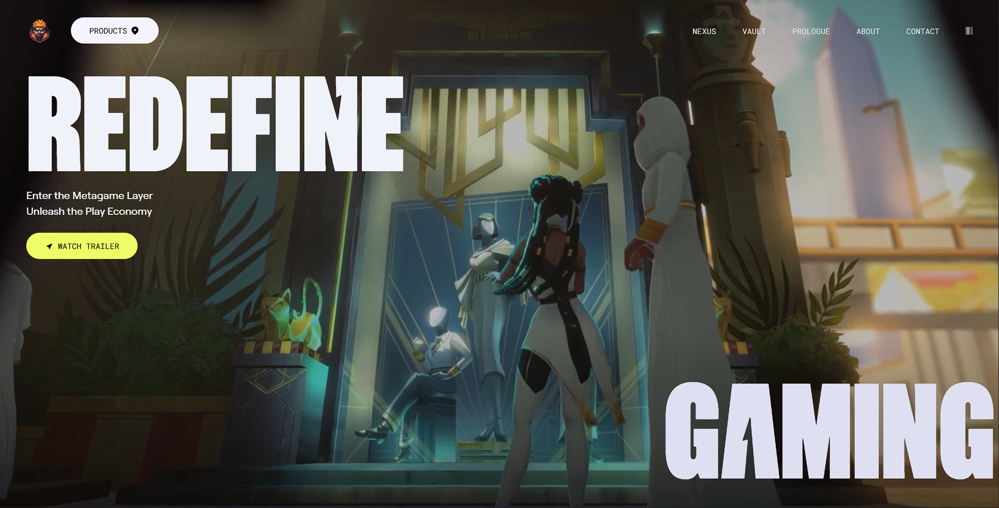

# Zentury - Into the Metagame Layer

> **Inspiration:** This project and its design are heavily inspired by the official **[zentry.com](https://zentry.com/)** website.

Welcome to **Zentury**, a cross-platform metagame app that turns your activities across Web2 and Web3 games into a rewarding adventure. Immerse yourself in a rich and ever-expanding universe where a vibrant array of products converge into an interconnected overlay experience on the world.

## 🎥 Project Preview

Watch the preview of the Zentury project universe below.



*(If the image doesn't show directly in your markdown viewer, you can view it at `public/img/zentury.png`)*

---

## 🚀 Features

- **Radiant**: A cross-platform metagame app bridging Web2 and Web3 gaming.
- **Zigma**: An anime and gaming-inspired NFT collection.
- **Nexus**: A gamified social hub for Web3 communities.
- **Azul**: A cross-world AI Agent elevating your gameplay.
- **Interactive Floating Navigation**: A dynamic navbar with scroll detection using GSAP animations.
- **Bento Grids & Hover Effects**: Interactive 3D mouse-tracking rotation (Tilt effect) and sleek overlay animations.

---

## 🛠️ Technologies Used

This project is built using modern frontend technologies tailored for high performance and sleek animations:

- **[React (v19)](https://react.dev/)**: Core library for building the user interface. Set up using **[Vite](https://vitejs.dev/)** for blazing-fast development servers and optimized builds.
- **[Tailwind CSS (v4)](https://tailwindcss.com/)**: A utility-first CSS framework for rapid UI styling, taking advantage of standard CSS features and custom themes.
- **[GSAP](https://gsap.com/) & [@gsap/react](https://www.npmjs.com/package/@gsap/react)**: Powerful industry-standard animation library used for smooth, performant scroll and UI animations (like the floating navbar).
- **[react-use](https://github.com/streamich/react-use)**: A collection of essential React hooks, primarily used for tracking window scrolling states (`useWindowScroll`).
- **[react-icons](https://react-icons.github.io/react-icons/)**: Lightweight library for integrating customizable SVG icons.

---

## 📦 Getting Started

### 1. Installation

Ensure you have Node.js installed, then run the following command to install all project dependencies:

```bash
npm install
```

### 2. Development server

Start the Vite development server by running:

```bash
npm run dev
```

Open your browser and navigate to `http://localhost:5173`. The server will hot-reload whenever you save changes.

### 3. Build for Production

To create an optimized production build:

```bash
npm run build
```

This will run the bundler and place all static and transformed assets in the `dist` folder.

---

## 🧑‍💻 File Structure Highlights

- `src/components/Navbar.jsx`: Implements the top navigation with audio visualizing toggles, scroll detection (`react-use`), and GSAP hide/reveal animations.
- `src/components/Features.jsx`: Contains the "Metagame Layer" interactive Bento UI with 3D tilting effects (`BentoTilt`) and multiple video backgrounds.
- `src/index.css`: Houses custom global styles, Tailwind configuration directives (`@theme`), arbitrary utility classes (`@utility`), keyframes, and font imports.
